# 04 — Блок-схеми

Схеми відображають рішення, ухвалені в [03](03-пріоритети-та-конфлікти.md). Якщо схема і документ 03 розходяться, істиною є 03.

**Синхрон з виконуваним графом:** `protocol/graphs/zero-echelon-core/` (`graphVersion` `2026-09-14-home`, плюс `engine-rules.json`). Зміна екрана без правки графа / rules — дефект процесу (див. [13](13-структура-репозиторію.md)).

Гілки позначені літерами і викликаються з головної схеми: A — безпека сцени, B — сортування, C — кровотеча, D — дихання і положення, E — грудна клітка, F — тривале стискання, G — психологічна підтримка, H — звіт і передача, I — друга хвиля, J — щоденний модуль.

---

## Головна схема

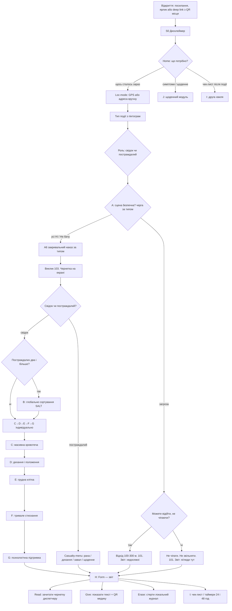

Зверніть увагу.

1. Гілка вето теж веде у звіт: люди біля загрози = **недосяжні**.
2. **Немає** ребра «підійти допомогти біля снаряда» (K5).
3. Виклик 103 — після A6, до сортування, коли зона умовно робоча.
4. Службової розвилки немає.
5. **Home** розводить гостру подію, J і I (I також з Form; локальний пуш 24/48 — клієнт).
6. **Loc-1** (адреса з QR на стіні) лишається для deep link; у меню Loc-mode кнопок «з QR» немає — лише GPS і ручне введення.
7. Під час допомоги (B–G) рушій може перервати на **A7** (повторна перевірка сцени) за `engine-rules` — це не крок одразу після A6 у головній стрічці.

---

## A. Безпека сцени

Порядок вузлів **залежить від типу події** (`engine-rules.json` → `safety.queuesByIncidentType`). Нижче — повний набір загроз; для ДТП, наприклад, черга `A4 → A3 → A5 → A6` (без UXO A1).

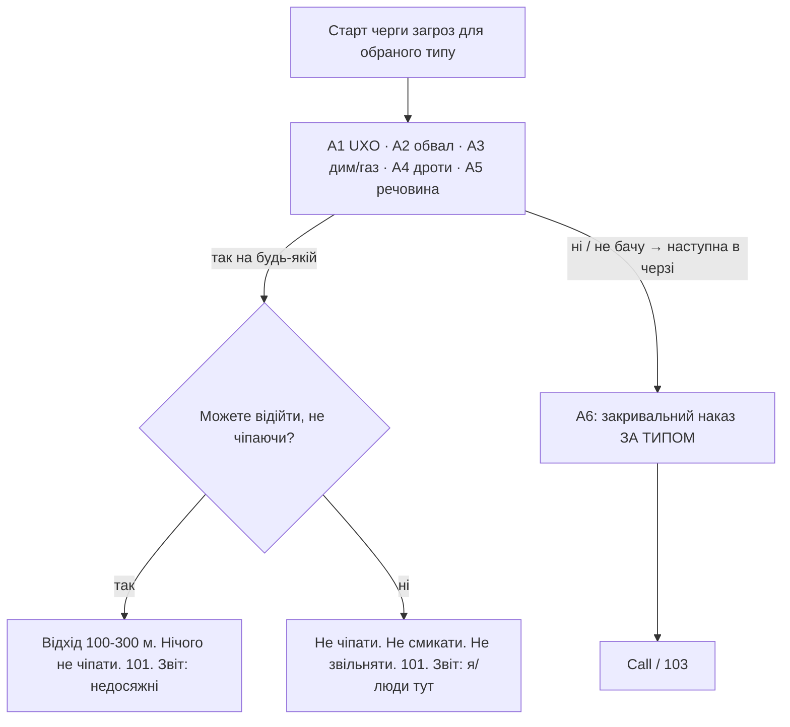

**A6 (голос залежить від типу, не лише «завал»):**

| Тип | Сенс наказу |
| --- | --- |
| ДТП (`traffic`) | Не на проїзджій; аварійка; не чіпати проводи |
| Пожежа | Не в дим/полумʼя; з навітряного боку; не відкривати гарячі двері |
| Хімія | Не чіпати рідину; не нюхати; проти вітру |
| Побут | Вимкнути джерело, якщо безпечно |
| Вибух / завал / потяг / стрілянина | Не в завал; не рухати уламки |

**A7** — періодичний interrupt під час допомоги після того, як сцена вже пройдена (`armAfterLeavingNodeId: A6`, інтервал з rules). Відповідь «загроза» → CanLeave.

Після «Так» на загрозі **немає** медичної гілки і **немає** «підійти до поранених». CanLeave розрізняє лише можливість відійти (K5a).

---

## B. Сортування SALT

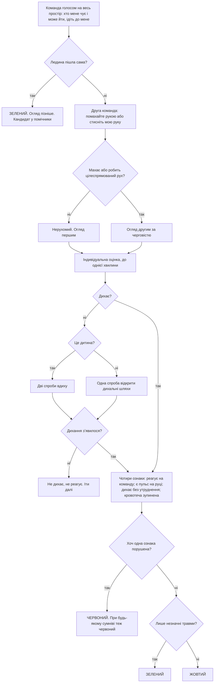

Категорій expectant і чорної в цій схемі немає навмисно: рішення «не виживе за наявних ресурсів» і констатація смерті лишаються бригаді.

---

## C. Масивна кровотеча

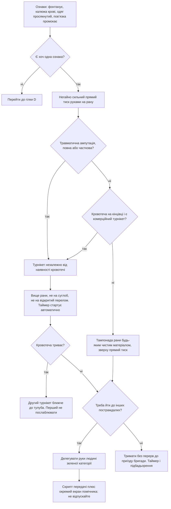

Вузол делегування — не зручність, а вимушене рішення: MUCC забороняє втручання, які змушують залишатися біля постраждалого, а безперервний тиск займає руки на всі 20–30 хвилин.

---

## D. Дихання і положення

```mermaid
flowchart TD
  D0{"Дихає нормально?"}
  D0 -->|"ні"| D1{"Був вибух або є проникне поранення?"}
  D1 -->|"так"| NoCpr["Реанімація не показана"]
  D1 -->|"ні"| Cpr["Компресії 100-120 за хвилину, глибина 5-6 см, без вдихів"]
  D0 -->|"так"| D2{"Свідок залишається поруч і може спостерігати?"}
  D2 -->|"так"| Sup["На спині. За потреби висування нижньої челюсті"]
  D2 -->|"ні"| Lat["Бічне положення. Прохідність важливіша за відсутній нагляд"]
  Sup --> Neck["Шию не фіксувати руками силоміць. Перевертати лише як єдине ціле і з помічником"]
  Lat --> Neck
  Cpr --> Metron["Метроном і великий візуальний лічильник"]
```

**NoCpr (draft K3):** у графі голос може казати «йдіть до наступного»; рушій для **одного** постраждалого / ролі casualty замінює на «залишайтесь, 103» — бо «наступного» немає. Потребує рецензії медика.

Розвилка D2 — найризикованіше продуктове рішення документації (виведена з умов ERC/TECC, не дослівна цитата). Потребує рецензії спеціаліста (draft K4).

---

## E. Грудна клітка

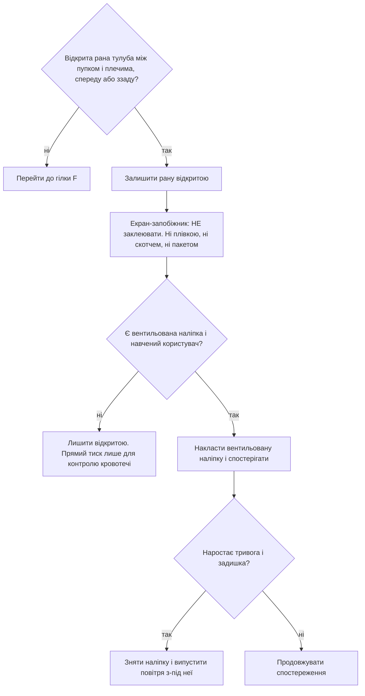

Причина екрана-запобіжника: народна інтуїція «заткнути дірку» і старі навчальні матеріали ведуть саме до герметизації, яка й спричиняє напружений пневмоторакс.

---

## F. Тривале стискання

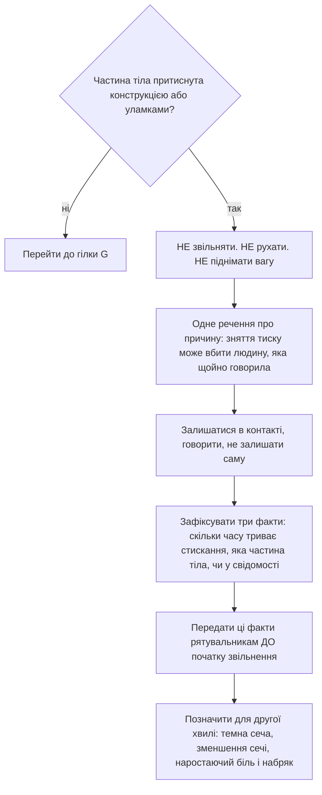

---

## G. Психологічна підтримка

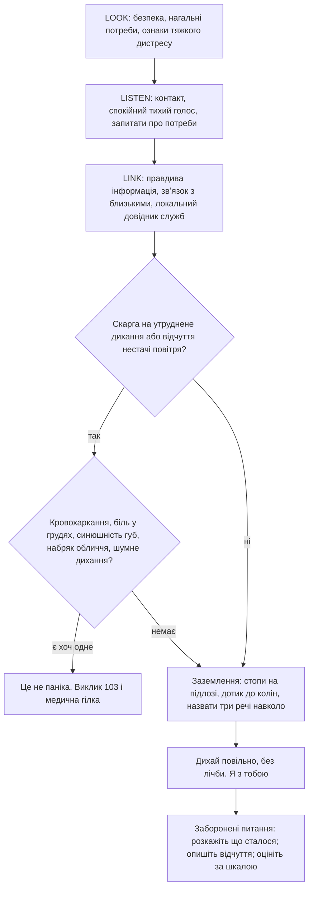

Гілка обслуговує і постраждалого, і самого свідка: ERC 2025 прямо вимагає готувати свідків до страху і морального дистресу під час допомоги.

---

## H. Звіт M/ETHANE і передача

Поля M/ETHANE збираються по ходу сценарію; на **Form** користувач обирає дію передачі. Мережі / ЕСОЗ немає.

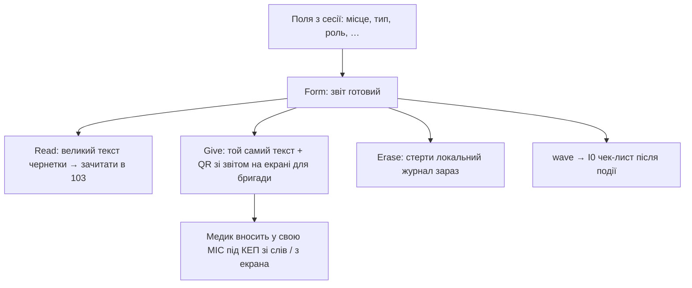

**Статус реалізації (синхрон з клієнтами):** чернетка диспетчера (тип + місце + роль) і QR з цим текстом — у роботі / MVP. Повний лічильник кольорів SALT, PDF, хеш-ланцюг — ще добудовуються (див. [08](08-звіт-M-ETHANE-та-передача.md)). Обґрунтування офлайн-передачі — [10](10-право-регуляторика-ліцензії.md).

---

## I. Друга хвиля

Входи: Home → wave; Form → wave; локальний таймер/пуш 24 і 48 год (клієнт).

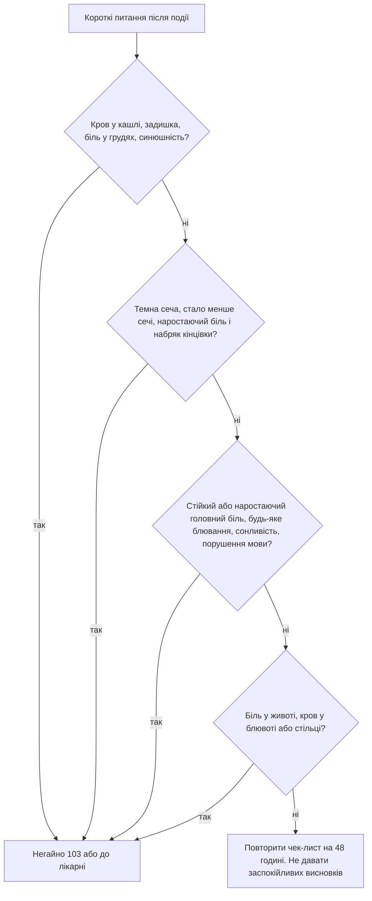

Формулювання односторонні: поява симптому веде до допомоги, а відсутність симптому не веде до висновку «все гаразд».

---

## J. Щоденний модуль

Входи: Home → daily; Casualty-menu → daily. **Без** гілки A і **без** SALT.

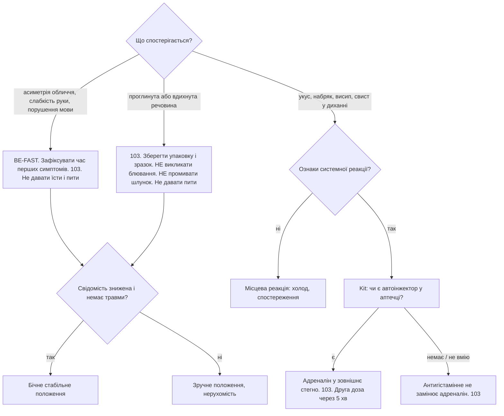

Інвентар-агностичність: вузол **Kit** питає наявність автоінжектора на шляху анафілаксії; загального «чек-листа всієї аптечки» перед J0 у графі немає. Припускати джгут/адреналін «бо вагон» не можна.

---

## Зведена карта залежностей

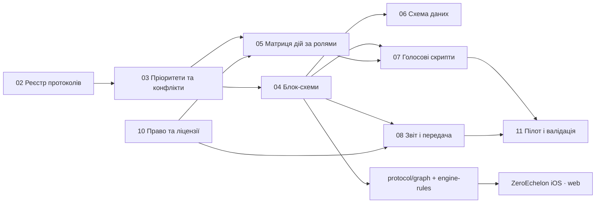

Зміна редакції протоколу: **docs → protocol → клієнти**. Правка лише UI без графа / 03–04 вважається дефектом процесу.
