# 04 — Блок-схеми

Схеми відображають рішення, ухвалені в [03](03-пріоритети-та-конфлікти.md). Якщо схема і документ 03 розходяться, істиною є 03.

Гілки позначені літерами і викликаються з головної схеми: A — безпека сцени, B — сортування, C — кровотеча, D — дихання і положення, E — грудна клітка, F — тривале стискання, G — психологічна підтримка, H — звіт і передача, I — друга хвиля, J — щоденний модуль.

---

## Головна схема

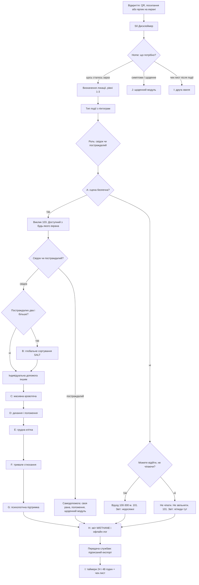

Зверніть увагу. По-перше, гілка вето теж веде у звіт: люди біля загрози = **недосяжні**, не «нічого не сталося». По-друге, **немає** ребра «підійти допомогти біля снаряда» (K5). По-третє, виклик 103 стоїть до сортування, коли зона умовно робоча. По-четверте, службової розвилки немає. **Home** розводить гостру подію, щоденний модуль J і чек-лист другої хвилі I (I також з Form і локального пуша).

---

## A. Безпека сцени

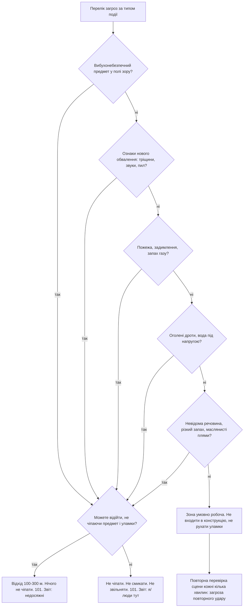

Після «Так» на загрозі **немає** медичної гілки і **немає** «підійти до поранених». CanLeave розрізняє лише можливість відійти (K5a). Гілка перевіряється повторно: безпечна сцена може стати небезпечною за хвилину.

---

## B. Сортування SALT

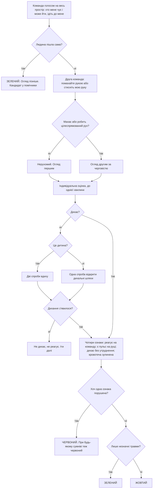

Категорій expectant і чорної в цій схемі немає навмисно: рішення «не виживе за наявних ресурсів» і констатація смерті лишаються бригаді.

---

## C. Масивна кровотеча

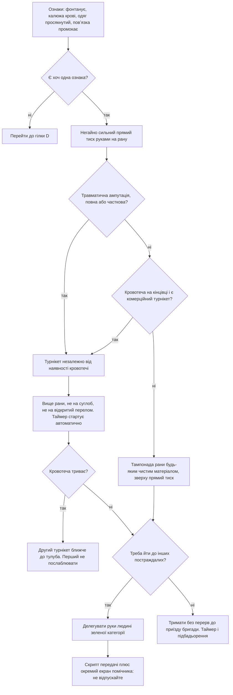

Вузол делегування — не зручність, а вимушене рішення: MUCC забороняє втручання, які змушують залишатися біля постраждалого, а безперервний тиск займає руки на всі 20–30 хвилин.

---

## D. Дихання і положення

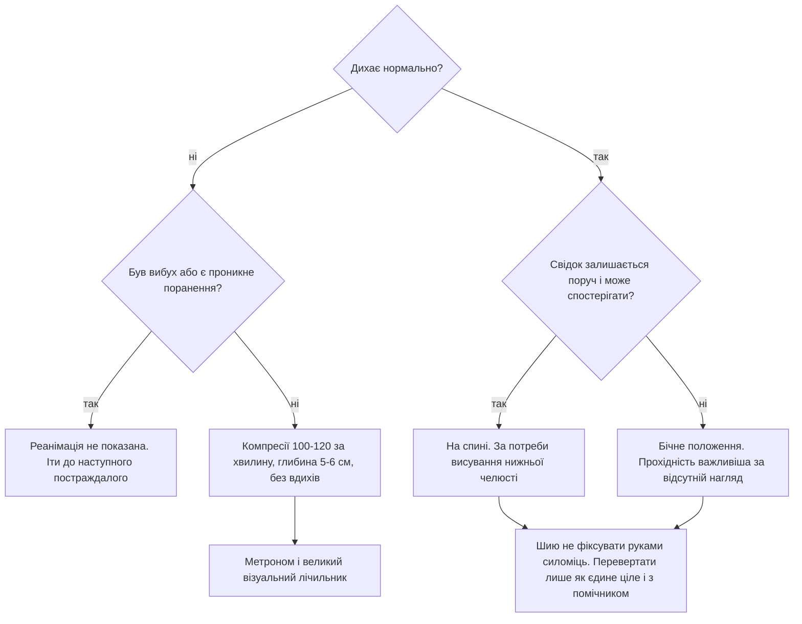

Розвилка D2 — найризикованіше продуктове рішення документації, бо воно виведене з умов застосування ERC і TECC, а не сформульоване прямо в жодному з них. Потребує рецензії спеціаліста.

---

## E. Грудна клітка

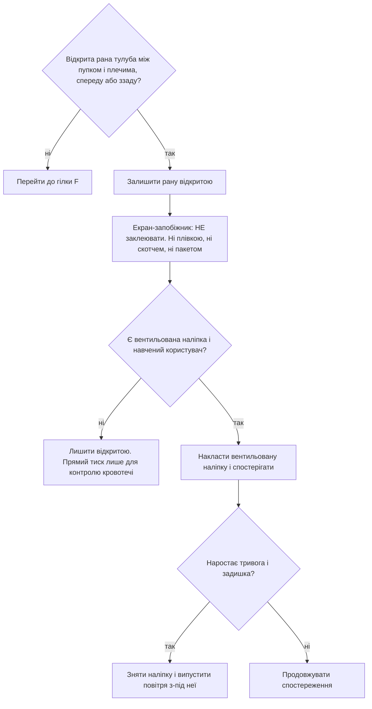

Причина екрана-запобіжника: народна інтуїція «заткнути дірку» і старі навчальні матеріали ведуть саме до герметизації, яка й спричиняє напружений пневмоторакс.

---

## F. Тривале стискання

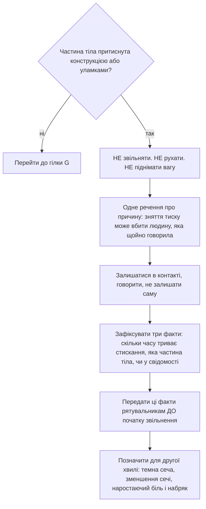

---

## G. Психологічна підтримка

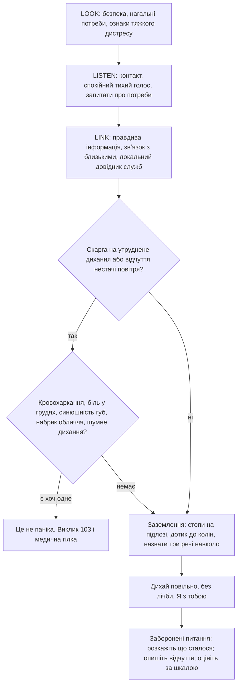

Гілка обслуговує і постраждалого, і самого свідка: ERC 2025 прямо вимагає готувати свідків до страху і морального дистресу під час допомоги.

---

## H. Звіт M/ETHANE і передача

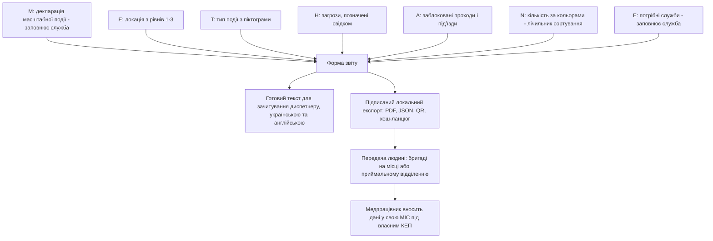

Мережевої інтеграції немає навмисно: писати до ЦК ЕСОЗ може лише зареєстрована МІС через КЕП верифікованого медпрацівника. Обґрунтування — [10](10-право-регуляторика-ліцензії.md).

---

## I. Друга хвиля

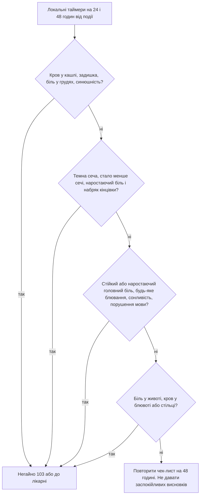

Формулювання односторонні: поява симптому веде до допомоги, а відсутність симптому не веде до висновку «все гаразд». CDC прямо зазначає, що визначених критеріїв спостереження і виписки після можливої баротравми не існує.

---

## J. Щоденний модуль

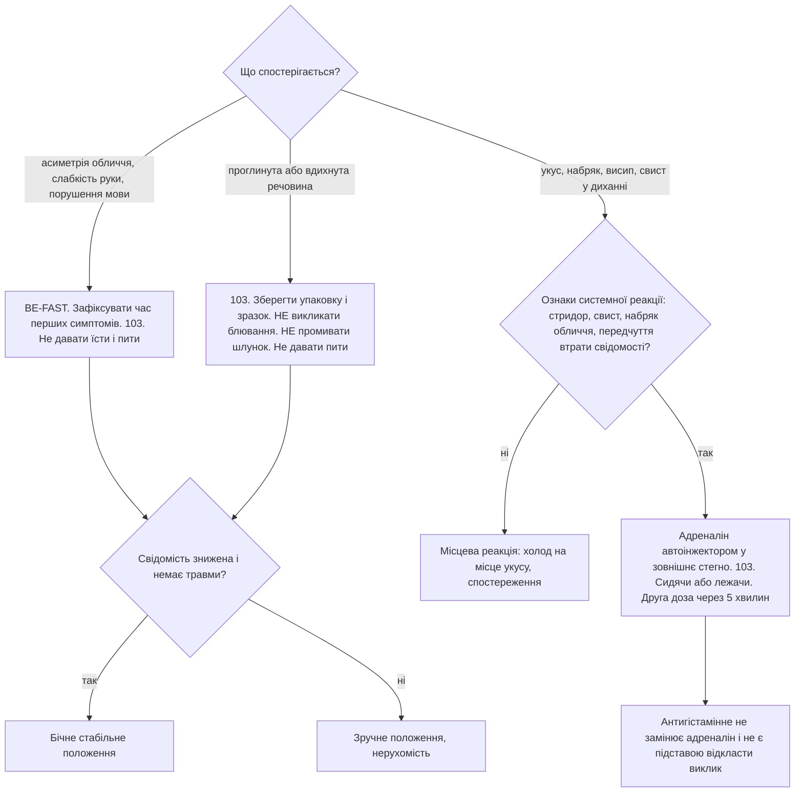

Модуль інвентар-агностичний: спершу питає, що є в наявній аптечці, і лише потім розгалужується. Нормативного переліку вкладень аптечки залізничного пасажирського вагона не існує, тому припускати наявність джгута або автоінжектора не можна.

---

## Зведена карта залежностей

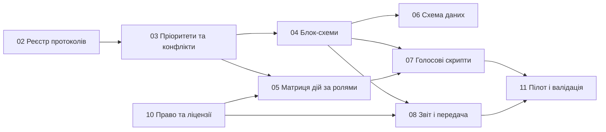

Зміна редакції протоколу проходить цим шляхом зліва праворуч. Правка екрана без проходу через реєстр і документ 03 вважається дефектом процесу.
