# 04 — Блок-схеми

Схеми відображають рішення, ухвалені в [03](03-пріоритети-та-конфлікти.md). Якщо схема і документ 03 розходяться, істиною є 03.

**Синхрон з виконуваним графом:** `protocol/graphs/zero-echelon-core/` (`graphVersion` `2026-10-05-witness-info`, плюс `engine-rules.json` з `civilianSafeMode.enabled: true`). Зміна екрана без правки графа / rules — дефект процесу (див. [13](13-структура-репозиторію.md)). Півот і відновлення лікування: [stakeholder/півот-цивільний-безпечний.md](stakeholder/півот-цивільний-безпечний.md).

**Активний продукт (civilianSafeMode):** Home → Disclaimer → Loc → Type → Role (цивільний свідок) → фіксація ознак A\* без наближення → Observe-count / Observe-signs → A6 (обмеження програми) → Call 112 → **Safe-civil** → Form / Give / Handed / Wave. **101** на екранах небезпечної зони. Дерева лікування **B–G** і модуль **J** лишаються в `graph.json`, але **приховані**. Повернути: `civilianSafeMode.enabled: false`.

Гілки позначені літерами: A — безпека сцени (активна), H — звіт і передача (активна), I — друга хвиля (активна), **Safe-civil** — цивільний безпечний лендінг після Call. B — сортування, C — кровотеча, D — дихання, E — грудна клітка, F — тривале стискання, G — психологічна підтримка, J — щоденний модуль — **архів / вимкнено civilianSafeMode** (не активний шлях продукту).

---

## Головна схема

Активний шлях SKU «безпечний свідок». Ребра Count → Care / Casualty-menu **немає** при `civilianSafeMode.enabled: true`.

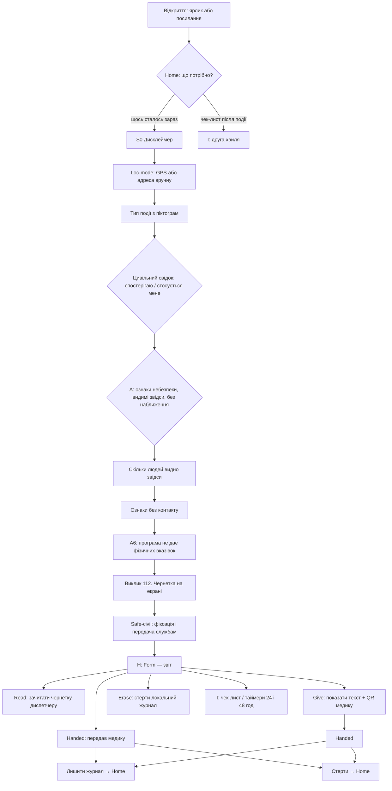
```mermaid
flowchart TD
  Start["Відкриття: ярлик або посилання"] --> Home{"Home: що потрібно?"}
  Home -->|"щось сталось зараз"| Disc["S0 Дисклеймер"]
  Disc --> Loc["Loc-mode: GPS або адреса вручну"]
  Home -->|"чек-лист після події"| WaveIn["I: друга хвиля"]
  Loc --> Type["Тип події з піктограм"]
  Type --> Role{"Цивільний свідок: спостерігаю / стосується мене"}
  Role --> Safety{"A: ознаки небезпеки, видимі звідси, без наближення"}
  Safety --> CountVis["Скільки людей видно звідси"]
  CountVis --> SignsVis["Ознаки без контакту"]
  SignsVis --> A6["A6: програма не дає фізичних вказівок"]
  A6 --> Call["Виклик 112. Чернетка на екрані"]
  Call --> SafeCivil["Safe-civil: фіксація і передача службам"]
  SafeCivil --> Form["H: Form — звіт"]
  Form --> Read["Read: зачитати чернетку диспетчеру"]
  Form --> Give["Give: показати текст + QR медику"]
  Form --> HandedF["Handed: передав медику"]
  Form --> Erase["Erase: стерти локальний журнал"]
  Form --> Wave["I: чек-лист / таймери 24 і 48 год"]
  Give --> HandedG["Handed"]
  HandedF --> Keep["Лишити журнал → Home"]
  HandedF --> Wipe["Стерти → Home"]
  HandedG --> Keep
  HandedG --> Wipe
```

Зверніть увагу.

1. Активний цивільний шлях **не** наказує відходити, наближатися, перевіряти предмети чи надавати допомогу. Ознаки «так» ідуть у звіт.
2. **Немає** ребра «підійти допомогти біля снаряда» (K5).
3. Виклик 112 — після фіксації видимого; далі **Safe-civil**, не сортування і не індивідуальна допомога.
4. Службової розвилки немає. Користувач — **цивільний свідок**.
5. **Home** — лише дві кнопки: «Щось сталось зараз» і «Чек-лист після події». Вхід **daily** (J) **прихований** (`hiddenHomeWhens`). Повний дисклеймер (S0) лише на шляху гострої події; I заходить без нього.
6. Місце: **GPS** або **адреса вручну одним рядком**. QR на стіні немає. QR на Give — чернетка звіту медику.
7. При `civilianSafeMode.enabled: true` interrupt **A7** під час допомоги B–G не активний у продукті (дерева сховані). Після відновлення лікування (`enabled: false`) A7 знову застосовується за `engine-rules`.
8. Після Call «Далі» → **Safe-civil** → Form. Після Form/Give — **Handed**: лишити журнал для 24/48 або стерти → Home. UI-рамка: top bar = бренд/Назад + голос + налаштування (мова не в top bar) — див. [12](12-екрани-та-специфікація.md).
9. Екстрені номери в UI: **112**; на вето-екранах — **101**. Номера **103** у продукті немає.

---

## A. Безпека сцени

Порядок вузлів **залежить від типу події** (`engine-rules.json` → `safety.queuesByIncidentType`). Нижче — повний набір загроз; для ДТП, наприклад, черга `A4 → A3 → A5 → A6` (без UXO A1).

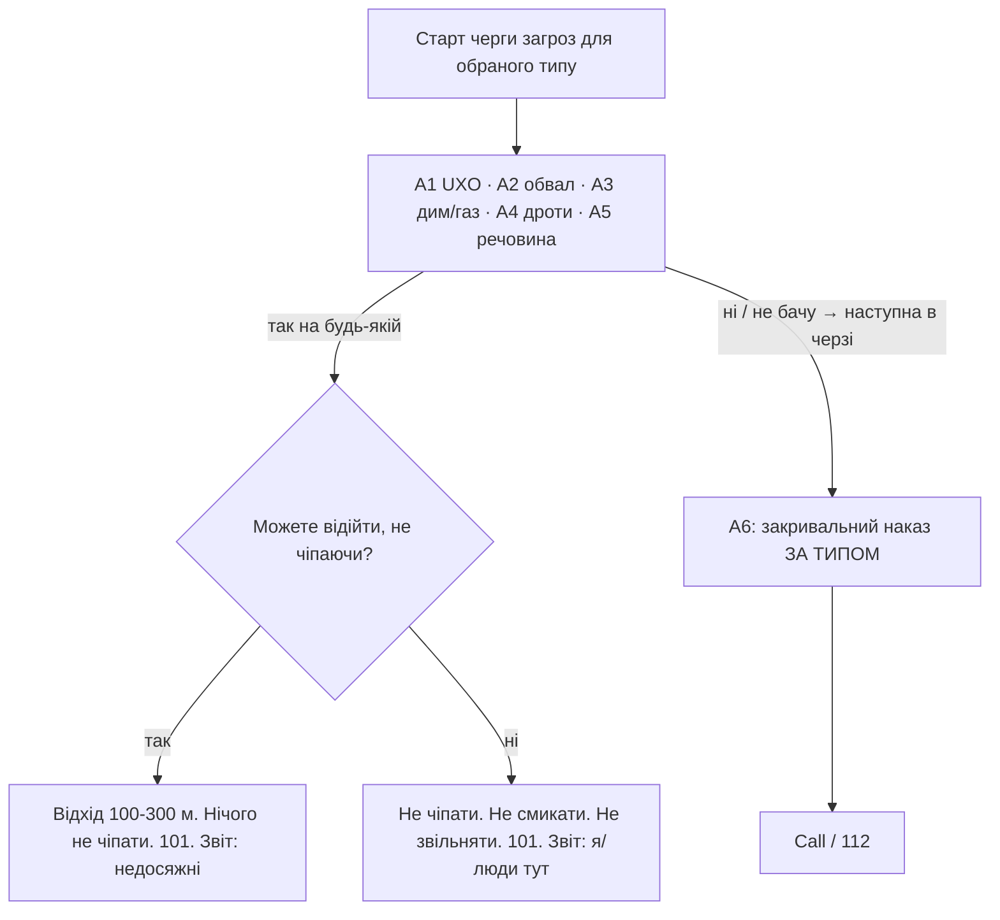
```mermaid
flowchart TD
  A0["Старт черги загроз для обраного типу"] --> Threats["A1 UXO · A2 обвал · A3 дим/газ · A4 дроти · A5 речовина"]
  Threats -->|"так на будь-якій"| CanLeave{"Можете відійти, не чіпаючи?"}
  Threats -->|"ні / не бачу → наступна в черзі"| A6["A6: закривальний наказ ЗА ТИПОМ"]
  CanLeave -->|"так"| Out["Відхід 100-300 м. Нічого не чіпати. 101. Звіт: недосяжні"]
  CanLeave -->|"ні"| OutTrap["Не чіпати. Не смикати. Не звільняти. 101. Звіт: я/люди тут"]
  A6 --> Call["Call / 112"]
```

**A6 (голос залежить від типу, не лише «завал»):**

| Тип | Сенс наказу |
| --- | --- |
| ДТП (`traffic`) | Не на проїзджій; аварійка; не чіпати проводи |
| Пожежа | Не в дим/полумʼя; з навітряного боку; не відкривати гарячі двері |
| Хімія | Не чіпати рідину; не нюхати; проти вітру |
| Побут | Вимкнути джерело, якщо безпечно |
| Вибух / завал / потяг / стрілянина | Не в завал; не рухати уламки |

**A7** — періодичний interrupt під час допомоги після того, як сцена вже пройдена (`armAfterLeavingNodeId: A6`, інтервал з rules). Відповідь «загроза» → CanLeave. У SKU з `civilianSafeMode` допомога B–G не показується — A7 актуальний лише після відновлення лікування.

Після «Так» на загрозі **немає** медичної гілки і **немає** «підійти до поранених». CanLeave розрізняє лише можливість відійти (K5a).

---

## Safe-civil — цивільний безпечний лендінг (після Call)

Активний вузол продукту. Після Call «Далі» рушій веде сюди (не в Count / Casualty-menu). Текст: не надавати медичну допомогу за вказівками додатка; після влучання / тривоги — не заходити в зону; викликати 112; далі — звіт.

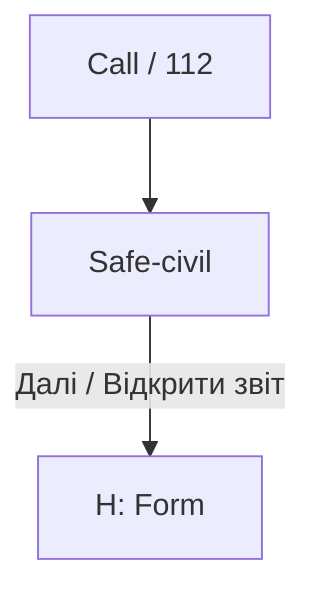
```mermaid
flowchart TD
  Call["Call / 112"] --> Safe["Safe-civil"]
  Safe -->|"Далі / Відкрити звіт"| Form["H: Form"]
```

---

## B. Сортування SALT

> **Архів / вимкнено civilianSafeMode.** Вузли лишаються в `graph.json` (`blockedBranches: B`). Не активний шлях продукту. Відновлення: `civilianSafeMode.enabled: false`.

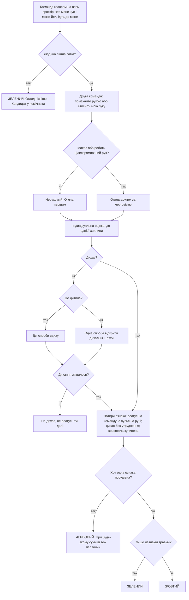
```mermaid
flowchart TD
  B0["Команда голосом на весь простір: хто мене чує і може йти, ідіть до мене"] --> B1{"Людина пішла сама?"}
  B1 -->|"так"| Green["ЗЕЛЕНИЙ. Огляд пізніше. Кандидат у помічники"]
  B1 -->|"ні"| B2["Друга команда: помахайте рукою або стисніть мою руку"]
  B2 --> B3{"Махає або робить цілеспрямований рух?"}
  B3 -->|"так"| Second["Огляд другим за черговістю"]
  B3 -->|"ні"| First["Нерухомий. Огляд першим"]
  First --> Ind["Індивідуальна оцінка, до однієї хвилини"]
  Second --> Ind
  Ind --> Br{"Дихає?"}
  Br -->|"ні"| Kid{"Це дитина?"}
  Kid -->|"так"| Two["Дві спроби вдиху"]
  Kid -->|"ні"| One["Одна спроба відкрити дихальні шляхи"]
  Two --> Again{"Дихання зʼявилося?"}
  One --> Again
  Again -->|"ні"| NoResp["Не дихає, не реагує. Іти далі"]
  Again -->|"так"| Four
  Br -->|"так"| Four["Чотири ознаки: реагує на команду; є пульс на руці; дихає без утруднення; кровотеча зупинена"]
  Four --> Any{"Хоч одна ознака порушена?"}
  Any -->|"так"| Red["ЧЕРВОНИЙ. При будь-якому сумніві теж червоний"]
  Any -->|"ні"| Minor{"Лише незначні травми?"}
  Minor -->|"так"| Green2["ЗЕЛЕНИЙ"]
  Minor -->|"ні"| Yellow["ЖОВТИЙ"]
```

Категорій expectant і чорної в цій схемі немає навмисно: рішення «не виживе за наявних ресурсів» і констатація смерті лишаються бригаді.

---

## C. Масивна кровотеча

> **Архів / вимкнено civilianSafeMode.** Вузли в графі (`blockedBranches: C`). Не активний шлях продукту.

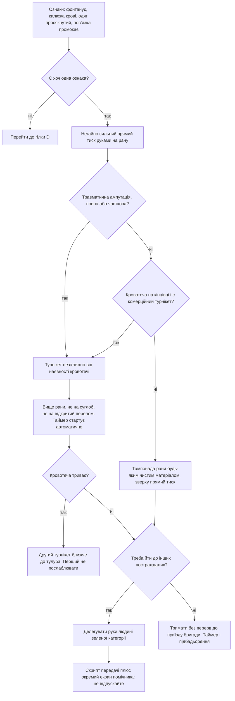
```mermaid
flowchart TD
  C0["Ознаки: фонтанує, калюжа крові, одяг просякнутий, повʼязка промокає"] --> C1{"Є хоч одна ознака?"}
  C1 -->|"ні"| Skip["Перейти до гілки D"]
  C1 -->|"так"| C2["Негайно сильний прямий тиск руками на рану"]
  C2 --> C3{"Травматична ампутація, повна або часткова?"}
  C3 -->|"так"| Tq["Турнікет незалежно від наявності кровотечі"]
  C3 -->|"ні"| C4{"Кровотеча на кінцівці і є комерційний турнікет?"}
  C4 -->|"так"| Tq
  C4 -->|"ні"| Pack["Тампонада рани будь-яким чистим матеріалом, зверху прямий тиск"]
  Tq --> TqRules["Вище рани, не на суглоб, не на відкритий перелом. Таймер стартує автоматично"]
  TqRules --> Still{"Кровотеча триває?"}
  Still -->|"так"| Second2["Другий турнікет ближче до тулуба. Перший не послаблювати"]
  Still -->|"ні"| Hands
  Pack --> Hands{"Треба йти до інших постраждалих?"}
  Hands -->|"так"| Deleg["Делегувати руки людині зеленої категорії"]
  Hands -->|"ні"| Hold["Тримати без перерв до приїзду бригади. Таймер і підбадьорення"]
  Deleg --> Script["Скрипт передачі плюс окремий екран помічника: не відпускайте"]
```

Вузол делегування — не зручність, а вимушене рішення: MUCC забороняє втручання, які змушують залишатися біля постраждалого, а безперервний тиск займає руки на всі 20–30 хвилин.

---

## D. Дихання і положення

> **Архів / вимкнено civilianSafeMode.** Вузли в графі (`blockedBranches: D`). Не активний шлях продукту.

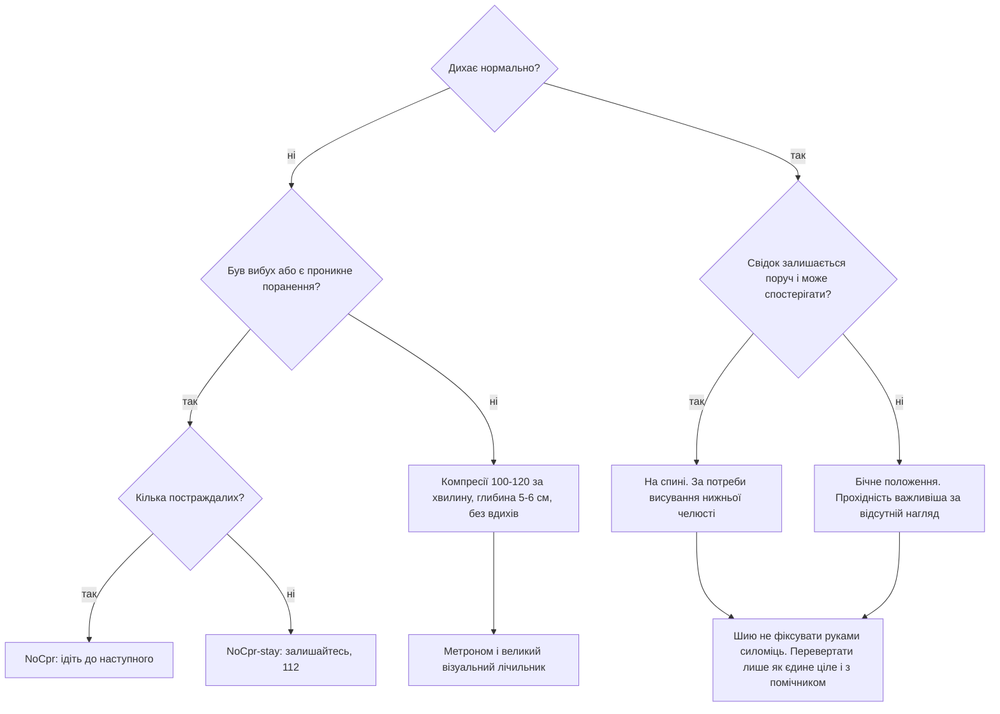
```mermaid
flowchart TD
  D0{"Дихає нормально?"}
  D0 -->|"ні"| D1{"Був вибух або є проникне поранення?"}
  D1 -->|"так"| NoCpr{"Кілька постраждалих?"}
  NoCpr -->|"так"| NoCprGo["NoCpr: ідіть до наступного"]
  NoCpr -->|"ні"| NoCprStay["NoCpr-stay: залишайтесь, 112"]
  D1 -->|"ні"| Cpr["Компресії 100-120 за хвилину, глибина 5-6 см, без вдихів"]
  D0 -->|"так"| D2{"Свідок залишається поруч і може спостерігати?"}
  D2 -->|"так"| Sup["На спині. За потреби висування нижньої челюсті"]
  D2 -->|"ні"| Lat["Бічне положення. Прохідність важливіша за відсутній нагляд"]
  Sup --> Neck["Шию не фіксувати руками силоміць. Перевертати лише як єдине ціле і з помічником"]
  Lat --> Neck
  Cpr --> Metron["Метроном і великий візуальний лічильник"]
```

**NoCpr (draft K3):** дві ситуації. Кілька постраждалих — «йдіть до наступного». Один або роль casualty — «залишайтесь, 112». Потребує рецензії медика.

Розвилка D2 — найризикованіше продуктове рішення документації (виведена з умов ERC/TECC, не дослівна цитата). Потребує рецензії спеціаліста (draft K4).

---

## E. Грудна клітка

> **Архів / вимкнено civilianSafeMode.** Вузли в графі (`blockedBranches: E`). Не активний шлях продукту.

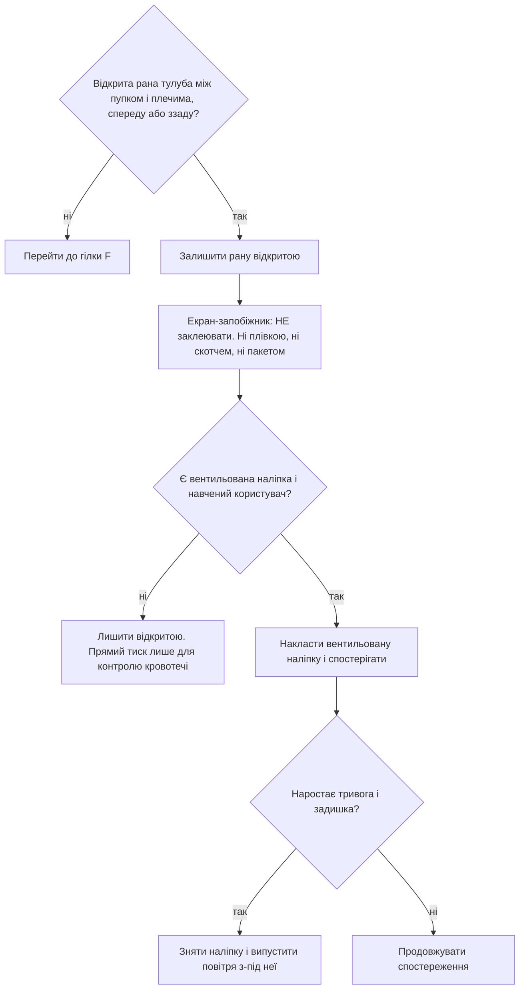
```mermaid
flowchart TD
  E0{"Відкрита рана тулуба між пупком і плечима, спереду або ззаду?"}
  E0 -->|"ні"| Next["Перейти до гілки F"]
  E0 -->|"так"| E1["Залишити рану відкритою"]
  E1 --> Anti["Екран-запобіжник: НЕ заклеювати. Ні плівкою, ні скотчем, ні пакетом"]
  Anti --> E2{"Є вентильована наліпка і навчений користувач?"}
  E2 -->|"ні"| Open["Лишити відкритою. Прямий тиск лише для контролю кровотечі"]
  E2 -->|"так"| Vent["Накласти вентильовану наліпку і спостерігати"]
  Vent --> E3{"Наростає тривога і задишка?"}
  E3 -->|"так"| Burp["Зняти наліпку і випустити повітря з-під неї"]
  E3 -->|"ні"| Watch["Продовжувати спостереження"]
```

Причина екрана-запобіжника: народна інтуїція «заткнути дірку» і старі навчальні матеріали ведуть саме до герметизації, яка й спричиняє напружений пневмоторакс.

---

## F. Тривале стискання

> **Архів / вимкнено civilianSafeMode.** Вузли в графі (`blockedBranches: F`). Не активний шлях продукту.

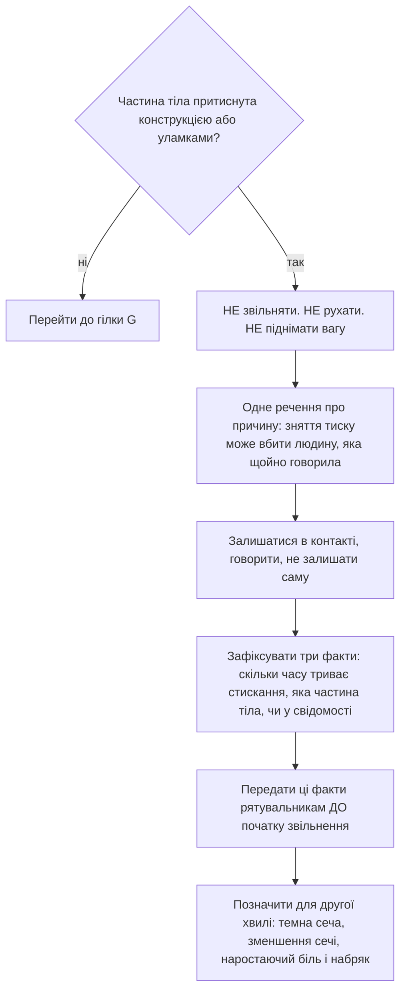
```mermaid
flowchart TD
  F0{"Частина тіла притиснута конструкцією або уламками?"}
  F0 -->|"ні"| Next2["Перейти до гілки G"]
  F0 -->|"так"| F1["НЕ звільняти. НЕ рухати. НЕ піднімати вагу"]
  F1 --> Why["Одне речення про причину: зняття тиску може вбити людину, яка щойно говорила"]
  Why --> F2["Залишатися в контакті, говорити, не залишати саму"]
  F2 --> F3["Зафіксувати три факти: скільки часу триває стискання, яка частина тіла, чи у свідомості"]
  F3 --> F4["Передати ці факти рятувальникам ДО початку звільнення"]
  F4 --> F5["Позначити для другої хвилі: темна сеча, зменшення сечі, наростаючий біль і набряк"]
```

---

## G. Психологічна підтримка

> **Архів / вимкнено civilianSafeMode.** Вузли в графі (`blockedBranches: G`). Не активний шлях продукту.

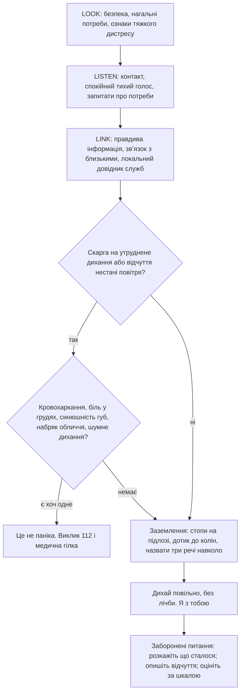
```mermaid
flowchart TD
  G0["LOOK: безпека, нагальні потреби, ознаки тяжкого дистресу"] --> G1["LISTEN: контакт, спокійний тихий голос, запитати про потреби"]
  G1 --> G2["LINK: правдива інформація, звʼязок з близькими, локальний довідник служб"]
  G2 --> G3{"Скарга на утруднене дихання або відчуття нестачі повітря?"}
  G3 -->|"так"| Flags{"Кровохаркання, біль у грудях, синюшність губ, набряк обличчя, шумне дихання?"}
  Flags -->|"є хоч одне"| Organic["Це не паніка. Виклик 112 і медична гілка"]
  Flags -->|"немає"| Ground["Заземлення: стопи на підлозі, дотик до колін, назвати три речі навколо"]
  G3 -->|"ні"| Ground
  Ground --> Slow["Дихай повільно, без лічби. Я з тобою"]
  Slow --> Ban["Заборонені питання: розкажіть що сталося; опишіть відчуття; оцініть за шкалою"]
```

Гілка обслуговує і постраждалого, і самого свідка: ERC 2025 прямо вимагає готувати свідків до страху і морального дистресу під час допомоги.

---

## H. Звіт M/ETHANE і передача

Поля M/ETHANE збираються по ходу сценарію; на **Form** користувач обирає дію передачі. Мережі / ЕСОЗ немає. У безпечному режимі після Call користувач потрапляє сюди через **Safe-civil** (без SALT / турнікета з дерев B–G).

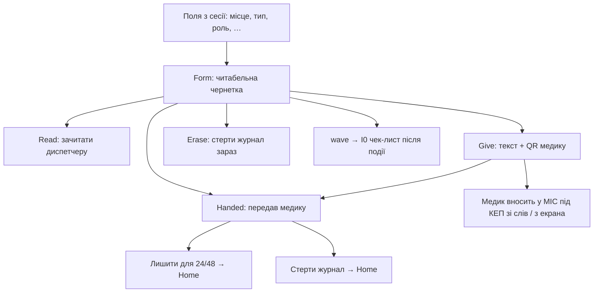
```mermaid
flowchart TD
  Fields["Поля з сесії: місце, тип, роль, …"] --> Form["Form: читабельна чернетка"]
  Form --> Read["Read: зачитати диспетчеру"]
  Form --> Give["Give: текст + QR медику"]
  Form --> Handed["Handed: передав медику"]
  Form --> Erase["Erase: стерти журнал зараз"]
  Form --> Wave["wave → I0 чек-лист після події"]
  Give --> Handed
  Handed --> Keep["Лишити для 24/48 → Home"]
  Handed --> Wipe["Стерти журнал → Home"]
  Give --> Mis["Медик вносить у МІС під КЕП зі слів / з екрана"]
```

**Статус реалізації (синхрон з клієнтами):** читабельна чернетка (тип · місце · роль · ключові факти; поля SALT N / турнікет — з архівних дерев, якщо режим лікування увімкнено знову), QR, Handed keep/erase, локальний журнал однієї події і нагадування 24/48 — у MVP. PDF і хеш-ланцюг — ще ні (див. [08](08-звіт-M-ETHANE-та-передача.md)). Обґрунтування офлайн-передачі — [10](10-право-регуляторика-ліцензії.md).

---

## I. Друга хвиля

Входи: Home → wave; Form → wave; локальний таймер/пуш 24 і 48 год (клієнт). Активний шлях продукту.

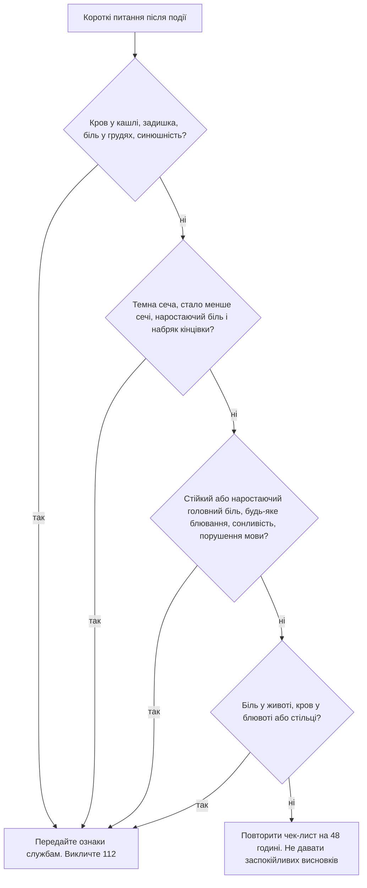
```mermaid
flowchart TD
  I0["Короткі питання після події"] --> I1{"Кров у кашлі, задишка, біль у грудях, синюшність?"}
  I1 -->|"так"| Go["Передайте ознаки службам. Викличте 112"]
  I1 -->|"ні"| I2{"Темна сеча, стало менше сечі, наростаючий біль і набряк кінцівки?"}
  I2 -->|"так"| Go
  I2 -->|"ні"| I3{"Стійкий або наростаючий головний біль, будь-яке блювання, сонливість, порушення мови?"}
  I3 -->|"так"| Go
  I3 -->|"ні"| I4{"Біль у животі, кров у блювоті або стільці?"}
  I4 -->|"так"| Go
  I4 -->|"ні"| I5["Повторити чек-лист на 48 годині. Не давати заспокійливих висновків"]
```

Формулювання односторонні: поява симптому веде до допомоги, а відсутність симптому не веде до висновку «все гаразд».

---

## J. Щоденний модуль

> **Архів / вимкнено civilianSafeMode.** Вхід Home → daily **прихований** (`hiddenHomeWhens`). Вузли в графі (`blockedBranches: J`). Не активний шлях продукту.

Входи (коли режим лікування відновлено): Home → daily; Casualty-menu → daily. **Без** гілки A і **без** SALT.

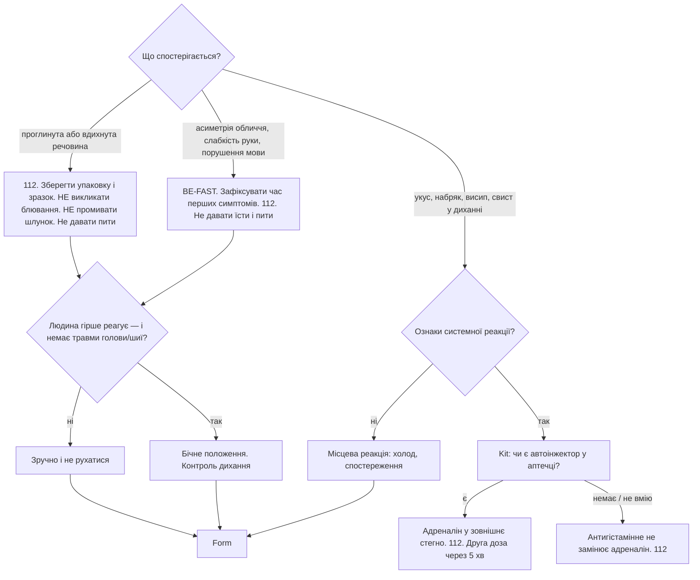
```mermaid
flowchart TD
  J0{"Що спостерігається?"}
  J0 -->|"асиметрія обличчя, слабкість руки, порушення мови"| Str["BE-FAST. Зафіксувати час перших симптомів. 112. Не давати їсти і пити"]
  J0 -->|"проглинута або вдихнута речовина"| Poi["112. Зберегти упаковку і зразок. НЕ викликати блювання. НЕ промивати шлунок. Не давати пити"]
  J0 -->|"укус, набряк, висип, свист у диханні"| Ana{"Ознаки системної реакції?"}
  Ana -->|"так"| Kit["Kit: чи є автоінжектор у аптечці?"]
  Kit -->|"є"| Adr["Адреналін у зовнішнє стегно. 112. Друга доза через 5 хв"]
  Kit -->|"немає / не вмію"| NoAnti["Антигістамінне не замінює адреналін. 112"]
  Ana -->|"ні"| Local["Місцева реакція: холод, спостереження"]
  Str --> Pos{"Людина гірше реагує — і немає травми голови/шиї?"}
  Poi --> Pos
  Pos -->|"так"| Side["Бічне положення. Контроль дихання"]
  Pos -->|"ні"| Comf["Зручно і не рухатися"]
  Local --> FormJ["Form"]
  Side --> FormJ
  Comf --> FormJ
```

Інвентар-агностичність: вузол **Kit** питає наявність автоінжектора на шляху анафілаксії; загального «чек-листа всієї аптечки» перед J0 у графі немає. Припускати джгут/адреналін «бо вагон» не можна.

**У графі:** Ana → Local; Str / Poi → Pos → Side або Comf → Form.

---

## Зведена карта залежностей

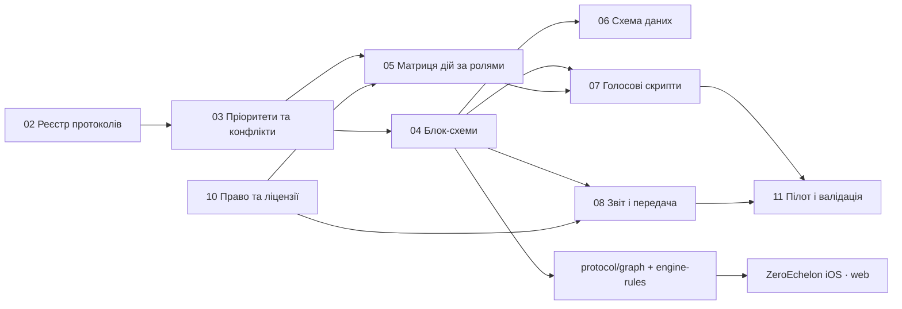
```mermaid
flowchart LR
  Reg["02 Реєстр протоколів"] --> Prec["03 Пріоритети та конфлікти"]
  Prec --> Flow["04 Блок-схеми"]
  Flow --> Schema["06 Схема даних"]
  Flow --> Voice["07 Голосові скрипти"]
  Prec --> Roles["05 Матриця дій за ролями"]
  Roles --> Voice
  Flow --> Report["08 Звіт і передача"]
  Legal["10 Право та ліцензії"] --> Roles
  Legal --> Report
  Voice --> Pilot["11 Пілот і валідація"]
  Report --> Pilot
  Flow --> Graph["protocol/graph + engine-rules"]
  Graph --> Clients["ZeroEchelon iOS · web"]
```

Зміна редакції протоколу: **docs → protocol → клієнти**. Правка лише UI без графа / 03–04 вважається дефектом процесу.
