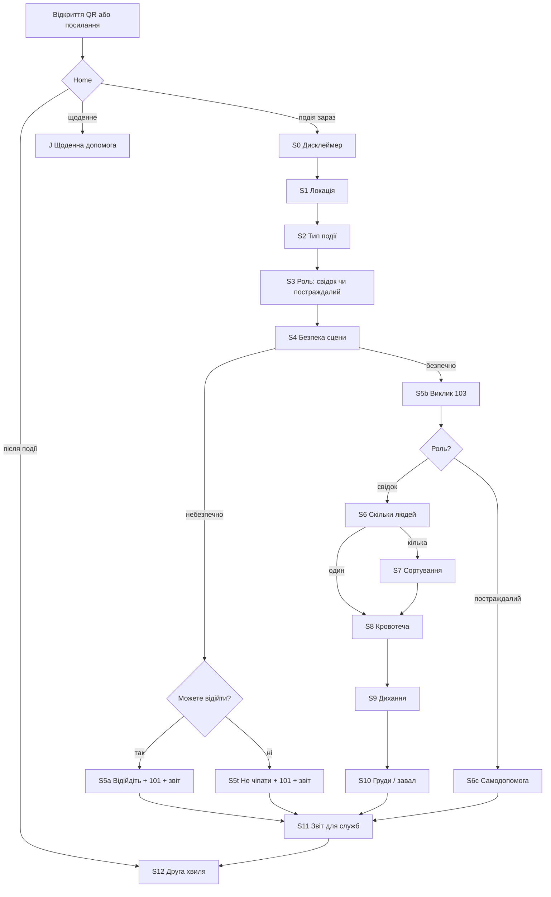

# 12 — Екрани, кнопки, специфікація для керівника

Документ для швидкого показу: **що людина побачить на телефоні**, які кнопки натисне і в якому порядку. Це не фінальний дизайн (кольори, шрифти) — це карта інтерфейсу. Медичні тексти беруться з [07](07-голосові-скрипти-UA-EN.md); логіка переходів — з [04](04-блок-схеми.md).

**Користувач:** лише цивільний — свідок або постраждалий. Службових екранів немає.

**Статус:** чернетка інтерфейсу. Можна показувати керівнику і малювати прототип. Спірні медичні фрази (позначені *draft*) може змінити рецензент-медик.

---

## 1. Як виглядає телефон узагалі

На кожному екрані однакова «рамка». Змінюється лише середина.

```
┌─────────────────────────────┐
│  UA | EN          ○ голос   │  ← мова і вмикач озвучення
├─────────────────────────────┤
│                             │
│   ВЕЛИКИЙ ТЕКСТ             │  ← одна фраза / одне питання
│   (голос читає те саме)     │
│                             │
│   [за потреби: заборона]    │  ← червоний рядок «НЕ …»
│                             │
├─────────────────────────────┤
│  [ Кнопка 1 ]               │  ← 1–3 великі кнопки
│  [ Кнопка 2 ]               │
│  [ Кнопка 3 ]               │
├─────────────────────────────┤
│  ███  ВИКЛИКАТИ 103  ███    │  ← завжди, на всіх екранах
└─────────────────────────────┘
```

Правила рамки:

| Елемент | Правило |
| --- | --- |
| Текст | Одна дія або одне питання. Літери великі, високий контраст. |
| Голос | Читає **дослівно** те, що на екрані (UA або EN). |
| Кнопки | Максимум три. Підписи короткі: Так / Ні / Далі / Тисну. |
| 103 | Червона смуга знизу. Не ховається за «Далі». Відкриває набір номера + готовий текст. |
| Меню протоколів | **Немає.** Немає розділів SALT / MARCH / PFA на вибір. |
| Акаунт, карта, хмара | **Немає.** |

Шість шаблонів на весь додаток (усі екрани нижче — один із них):

1. **Питання** — Так / Ні / Не можу  
2. **Наказ** — Зрозумів / Далі (+ інколи заборона)  
3. **Вето** — тільки 101 і «Відкрити звіт»  
4. **Виклик** — Набрати / Зачитати / Далі  
5. **Утримання** — таймер + «Не відпускайте» / «Делегувати руки»  
6. **Звіт** — Показати / QR / Стерти  

---

## 2. Карта екранів (блок-схема)



Окремий вхід з Home: **симптоми / щоденна допомога** → J; **чек-лист після події** → I — **без** повного S0. Дисклеймер лише перед гострою подією.

---

## 3. Каталог екранів

### Home — Головний екран

| | |
| --- | --- |
| **Навіщо** | Не змішувати гостру подію, щоденні симптоми і чек-лист 24/48 год |
| **Бренд** | **Line 24** у лівому слоті top bar (там, де на інших екранах «Назад»; не в TTS) |
| **Текст** | «Оберіть. Що потрібно зараз?» |
| **Остання подія** | Під кнопками Home (після «Чек-лист…»): дата/час + `Відкрити звіт` → Form, якщо є локальний журнал (до 48 год) |
| **Кнопки** | `Щось сталось зараз` → S0 · `Симптоми / щоденна допомога` → J · `Чек-лист після події` → S12 |
| **Немає** | Повного юридичного тексту перед J/I |

### S0 — Дисклеймер (гострий шлях)

| | |
| --- | --- |
| **Навіщо** | Чесне попередження перед сценою; локальний запис «погодився» |
| **Текст** | «Спочатку викличте 103, якщо можете. Цей застосунок лише підказує кроки — рішення ваші. Закон сам по собі вас за допомогу не захищає.» |
| **Кнопки** | `Погоджуюсь` → S1 · `Викликати 103` → набір |
| **Немає** | Довгого тексту політики; галочки «прочитав усе» |

### S1 — Локація

| | |
| --- | --- |
| **Навіщо** | Адреса для диспетчера |
| **Варіанти** | **Loc-mode:** GPS (координати) або адреса вручну (поля по одному). **Loc-1** — лише якщо відкрили з QR місця (deep link), не кнопка в меню. |
| **Кнопки** | `Далі` · `Виправити` · завжди `103` |
| **Підпис зверху** | «Точність: координати / вручну» (або «з коду», якщо Loc-1) |

### S2 — Тип події

| | |
| --- | --- |
| **Навіщо** | Поле T у звіті; впливає на безпеку і правило реанімації |
| **UI** | Великі піктограми в сітці (одна картинка = вибір) |
| **Варіанти** | Вибух · Обвал · Пожежа · ДТП · Потяг · Стрілянина · Хімія · Побутове · Інше |
| **Кнопки** | тап по картинці = далі · `103` |

### S3 — Роль

| | |
| --- | --- |
| **Навіщо** | Два цивільні дерева: допомога іншим / собі |
| **Текст** | «Ви допомагаєте іншим — чи допомога потрібна вам?» |
| **Кнопки** | `Допомагаю іншим` (свідок) · `Допомога мені` (постраждалий) · `103` |
| **Немає** | Провідник / поліція / ДСНС |

### S4 — Безпека сцени (серія питань)

Один екран = одне питання. Порядок: міна/предмет → новий обвал → вогонь/дим → дроти → невідома речовина.

| | |
| --- | --- |
| **Текст приклад** | «Чи бачите міну, уламок, дрон, підозрілий предмет?» |
| **Кнопки** | `Так` → CanLeave · `Ні` → наступне питання · `Не бачу` → як Ні |
| **Якщо всі Ні** | → S5b |
| **Немає** | «Підійти допомогти біля снаряда» |

### S4b — CanLeave (після будь-якої загрози)

| | |
| --- | --- |
| **Текст** | «Чи можете зараз відійти від небезпеки, не чіпаючи предмет і уламки?» |
| **Кнопки** | `Так, можу відійти` → S5a · `Ні, не можу` → S5t |
| **Навіщо** | K5a: не наказувати «йдіть 300 м» тому, хто під завалом |

### S5a — Вето: можете відійти

| | |
| --- | --- |
| **Текст** | «Відійдіть на сто–триста метрів. Нічого не чіпайте. Натисніть 101 внизу. Не повертайтесь.» |
| **Кнопки** | `Відкрити звіт` (люди біля загрози = недосяжні) |
| **Немає** | Медичних кроків, «підійти обережно», дубля «Викликати 101» у контенті (є смуга внизу) |

### S5t — Вето: не можете відійти

| | |
| --- | --- |
| **Текст** | «Не чіпайте предмет і уламки. Не смикайте. Не звільняйте. Натисніть 101 внизу. У звіті — ви або люди тут.» |
| **Кнопки** | `Відкрити звіт` |
| **Немає** | «Відійдіть 300 м», медицини біля UXO, звільнення завалу |

### S5b — Виклик 103

| | |
| --- | --- |
| **Текст зверху** | «Викличте 103. Зачитайте текст нижче.» |
| **Середина** | Готовий абзац: де / що / скільки (якщо вже відомо) / хто дзвонить |
| **Кнопки** | `Зачитати вголос` · `Далі` (не скасовує виклик); набір — червона смуга |

### S6 — Скільки людей (лише свідок)

| | |
| --- | --- |
| **Текст** | «Скільки людей постраждало?» |
| **Кнопки** | `Один` → S8 · `Двоє і більше` → S7 · `103` |

### S6c — Самодопомога (постраждалий)

| | |
| --- | --- |
| **Навіщо** | Без сортування чужих |
| **Кнопки-меню** | `Кровотеча у мене` · `Важко дихати` · `Я під завалом` · `Інше (щоденне)` · `103` |
| **Далі** | Ті самі шаблони S8–S10, але про себе → S11 |

### S7 — Сортування (свідок, кілька людей)

| | |
| --- | --- |
| **Текст** | «Скажіть голосно: хто мене чує і може йти — ідіть до мене.» |
| **Кнопки** | `Пішли до мене` · `Ніхто не йде` · `103` |
| **Наступний екран** | «Ідіть до того, хто не рухається. Не до того, хто кричить.» → `Йду` / `103` |

### S8 — Кровотеча

| | |
| --- | --- |
| **Питання** | «Кров фонтанує? Калюжа? Одяг мокрий від крові?» |
| **Кнопки питання** | `Так` / `Ні` |
| **Якщо Так — наказ** | «Натисніть на рану обома руками. Тисніть сильно. Не відпускайте.» |
| **Заборона** | «Не робіть джгут із ременя чи шарфа.» |
| **Кнопки наказу** | `Тисну` · `Є джгут з аптечки` · `Делегувати руки` · `103` |
| **Утримання** | Таймер на екрані + «Не відпускайте» + голос періодично |

**Делегування (під-екран):** «Підкличте людину, яка ходить. Покладіть її руки на свої. Скажіть: тисніть, не відпускайте.» → `Передав` / `Немає кого` / `103`

### S9 — Дихання *частина draft для медика*

| | |
| --- | --- |
| **Питання** | «Людина дихає нормально?» → `Так` / `Ні` |
| **Якщо Ні** | «Був вибух або є рана в тіло?» → якщо так: «Реанімація тут не допоможе. Ідіть до наступного.» *(draft K3)* |
| **Якщо Так** | «Ви лишаєтесь біля цієї людини?» → Так: на спині · Ні: на бік *(draft K4)* |
| **Кнопки** | за питанням · `103` |

### S10 — Груди / завал

Два підряд екрани-накази.

**Груди:** «Є дірка в грудях або спині? Залиште відкритою.»  
Заборона: «Не заклеюйте. Ні плівкою, ні скотчем, ні пакетом.»  
Кнопки: `Зрозумів` · `Немає такої рани` · `103`

**Завал:** «Частину тіла притиснуло? Не звільняйте. Не піднімайте вагу.»  
Пояснення: «Якщо зняти тиск зараз — людина, яка говорить, може раптово померти.»  
Кнопки: `Не звільняю` · `Ніхто не притиснутий` · `103`  
Далі: три поля (скільки часу / яка частина / чи у свідомості) → у звіт.

### S11 — Звіт для служб

| | |
| --- | --- |
| **Навіщо** | Показати бригаді, не відправляти в хмару |
| **На екрані** | Чернетка: тип · місце · роль (далі — повний M/ETHANE) |
| **Кнопки** | `Зачитати диспетчеру` → Read · `Показати медика / QR` → Give · `Чек-лист після події` → I · `Стерти журнал` |
| **Немає** | «Надіслати в ЕСОЗ» · «Запис до лікаря» |

### S12 — Друга хвиля (через 24 і 48 год)

Локальне сповіщення (`UNUserNotificationCenter`, не APNs) → короткий чек-лист (кров у кашлі, темна сеча, головний біль/блювання, біль у животі).  
Таймери від `startedAt` події після досягнення Form. Erase скасовує обидва нагадування.  
Будь-яке `Так` → `Викликати 103`.  
Усі `Ні` → «Спостереження триває. Це не висновок “усе добре”.» *(не заспокоювати)*

---

## 4. Щоденна допомога (вхід з Home або casualty → інше)

З **Home → Симптоми / щоденна допомога** або після ролі «постраждалий → інше».

| Екран | Питання / наказ | Кнопки |
| --- | --- | --- |
| Інсульт | Усмішка / рука / мова + час початку | `Викликати 103` · `Запамʼятав час` |
| Отруєння | Зберегти упаковку; **не** блювати, **не** промивати | `103` · `Зрозумів` |
| Укус / анафілаксія | Свист, набряк обличчя? → адреналін у стегно або тільки 103 | `Так, системно` · `Лише місцеве` · `103` |

Спочатку екран «Що є в аптечці?» (чек-лист), без припущення що там джгут чи автоінжектор.

---

## 5. Специфікація прототипу (MVP каркаса)

Що достатньо зробити, щоб показати керівнику «живий» макет:

| № | Функція | Обовʼязково |
| --- | --- | --- |
| 1 | Прохід S0→S11 пальцем без мережі | так |
| 2 | Кнопка 103 на кожному екрані (хоча б відкриває `tel:103`) | так |
| 3 | Перемикач UA/EN | так |
| 4 | Озвучення рядка (системний TTS) | бажано |
| 5 | Локація: GPS-координати + ручне введення адреси (Loc-1 = deep link) | так |
| 6 | Журнал локально (одна подія: кроки + локація; без історії багатьох); на Home — дата + «Відкрити звіт» | так (iOS + web) |
| 7 | Екран звіту: чернетка + Read/Give (текст; QR на Give) | так |
| 7a | Локальні нагадування 24/48 → I0 | так (iOS `UNUserNotificationCenter`; web — демо Notification) |
| 8 | Хмара, логін, ЕСОЗ, пуш з сервера | **ні** |
| 9 | Фінальний візуальний дизайн | **ні** |

Технічний принцип: тексти і переходи — з файлу даних (граф), не захардкоджені в кнопках. Тоді правки медика = заміна даних, не перепис додатка.

---

## 6. Що сказати керівнику за 2 хвилини

1. Це не меню з протоколами — це **навігатор однієї дії**.  
2. На кожному екрані завжди є **103**.  
3. Користувач лише **свідок** або **постраждалий**.  
4. Якщо небезпечно — медицини немає, тільки відхід і 101.  
5. У кінці — **екран для медика**, не інтеграція з ЕСОЗ.  
6. Поки юрист і медик рецензують — можна будувати саме цей каркас.

Повний алгоритм (медицина) — у [04](04-блок-схеми.md). Дослівні фрази — у [07](07-голосові-скрипти-UA-EN.md).
