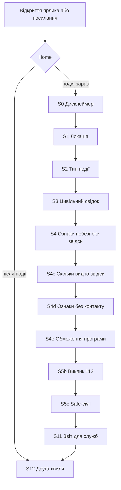

# 12 — Екрани, кнопки, специфікація для керівника

Документ для швидкого показу: **що людина побачить на телефоні**, які кнопки натисне і в якому порядку. Це не фінальний дизайн (кольори, шрифти) — це карта інтерфейсу. Медичні тексти беруться з [07](07-голосові-скрипти-UA-EN.md); логіка переходів — з [04](04-блок-схеми.md).

**Користувач:** цивільний свідок. Службових екранів немає. Класифікації за рівнем підготовки немає.

**Активний SKU (civilianSafeMode, `enabled: true`):** Home (2 кнопки) → Disclaimer → Loc → Type → Role (цивільний свідок) → фіксація ознак небезпеки A\* → кількість і ознаки, видимі звідси → Call 112 → **Safe-civil** → Form / Give / Handed / Wave. На екранах небезпечної зони — **101**. Команди лікування і фізичного втручання **не показуються**. Деталі: [stakeholder/півот-цивільний-безпечний.md](stakeholder/півот-цивільний-безпечний.md).

**Статус:** чернетка інтерфейсу. Можна показувати керівнику і малювати прототип. Спірні медичні фрази в архівних екранах (позначені *draft*) може змінити рецензент-медик.

---

## 1. Як виглядає телефон узагалі

На кожному екрані однакова «рамка». Змінюється лише середина.

```
┌─────────────────────────────┐
│  Line 24 / Назад   🔊   ⚙  │  ← бренд або «Назад»; голос; налаштування
├─────────────────────────────┤
│                             │
│   ВЕЛИКИЙ ТЕКСТ             │  ← одна фраза / одне питання
│   (голос читає те саме)     │
│                             │
│   [за потреби: заборона]    │  ← червоний рядок «НЕ …»
│                             │
├─────────────────────────────┤
│  [ Кнопка 1 ]               │  ← 1–3 великі кнопки (Type: сітка 3×3 іконок)
│  [ Кнопка 2 ]               │
│  [ Кнопка 3 ]               │
├─────────────────────────────┤
│  ███  ВИКЛИКАТИ 112  ███    │  ← завжди, на всіх екранах
└─────────────────────────────┘
```

**Налаштування (⚙, окремий повний екран, не вузол графа):** мова (окремий під-екран списку) · озвучення · Privacy / Support / Terms · версія. Розділи візуально розділені картками.

Правила рамки:

| Елемент | Правило |
| --- | --- |
| Текст | Одна дія або одне питання. Літери великі, високий контраст. |
| Голос | Читає **дослівно** те, що на екрані (UA або EN). Швидкий вмикач — у top bar; дубль — у Налаштуваннях. |
| Мова | Лише в Налаштуваннях (зберігається між запусками). |
| Кнопки | Максимум три на звичайних екранах. Type — сітка піктограм. Підписи короткі: Так / Ні / Далі / Тисну. |
| 112 | Червона смуга знизу. Не ховається за «Далі». Відкриває набір номера + готовий текст. |
| Меню протоколів | **Немає.** Немає розділів SALT / MARCH / PFA на вибір. |
| Акаунт, карта, хмара | **Немає.** |

Шаблони на весь додаток (усі екрани нижче — один із них):

1. **Питання** — Так / Ні / Не можу  
2. **Наказ** — Зрозумів / Далі (+ інколи заборона)  
3. **Вето** — тільки 101 і «Відкрити звіт»  
4. **Виклик** — Набрати / Зачитати / Далі  
5. **Утримання** — таймер + «Не відпускайте» / «Делегувати руки» *(архів: екрани лікування)*  
6. **Звіт** — Показати / QR / Стерти  

---

## 2. Карта екранів (блок-схема)

Активний шлях продукту. Count → Care і Casualty-menu **не показуються** при `civilianSafeMode`.


```mermaid
flowchart TD
  Open["Відкриття ярлика або посилання"] --> Home{"Home"}
  Home -->|"подія зараз"| S0["S0 Дисклеймер"]
  S0 --> S1["S1 Локація"]
  Home -->|"після події"| S12["S12 Друга хвиля"]
  S1 --> S2["S2 Тип події"]
  S2 --> S3["S3 Цивільний свідок"]
  S3 --> S4["S4 Ознаки небезпеки звідси"]
  S4 --> S4c["S4c Скільки видно звідси"]
  S4c --> S4d["S4d Ознаки без контакту"]
  S4d --> S4e["S4e Обмеження програми"]
  S4e --> S5b["S5b Виклик 112"]
  S5b --> S5c["S5c Safe-civil"]
  S5c --> S11["S11 Звіт для служб"]
  S11 --> S12
```

Окремий вхід з Home: **чек-лист після події** → I — **без** повного S0. Дисклеймер лише перед гострою подією. Вхід **симптоми / щоденна допомога** (J) **прихований** до відновлення лікування (`civilianSafeMode.enabled: false`).

---

## 3. Каталог екранів

### Home — Головний екран

| | |
| --- | --- |
| **Навіщо** | Не змішувати гостру подію і чек-лист 24/48 год |
| **Бренд** | **Line 24** у лівому слоті top bar (там, де на інших екранах «Назад»; не в TTS). Справа: голос + налаштування. |
| **Текст** | «Оберіть. Що потрібно зараз?» |
| **Остання подія** | Під кнопками Home (після «Чек-лист…»): дата/час + `Відкрити звіт` → Form, якщо є локальний журнал (до 48 год) |
| **Кнопки** | `Щось сталось зараз` → S0 · `Чек-лист після події` → S12 |
| **Приховано** | `Симптоми / щоденна допомога` → J (`hiddenHomeWhens: daily`) |
| **Немає** | Повного юридичного тексту перед I; третьої кнопки daily у активному SKU |

### S0 — Дисклеймер (гострий шлях)

| | |
| --- | --- |
| **Навіщо** | Чесне попередження перед сценою; локальний запис «погодився» |
| **Текст** | Великий: «Спочатку викличте 112, якщо можете.» Менший під ним: «Програма фіксує доступну інформацію і забезпечує виклик екстрених служб. Вона не замінює професійні служби і не надає юридичних консультацій.» |
| **Кнопки** | `Погоджуюсь` → S1 · `Викликати 112` → набір |
| **Немає** | Довгого тексту політики; галочки «прочитав усе» |

### S1 — Локація

| | |
| --- | --- |
| **Навіщо** | Адреса для диспетчера |
| **Варіанти** | **Loc-mode:** GPS (координати) або адреса вручну **одним рядком**. QR на стіні немає. |
| **Кнопки** | `Далі` · `Виправити` · завжди `112` |
| **Підпис зверху** | «Точність: координати / вручну» |

### S2 — Тип події

| | |
| --- | --- |
| **Навіщо** | Поле T у звіті; впливає на чергу безпеки сцени |
| **UI** | Великі піктограми в сітці 3×3 (іконка + підпис; один тап = один вибір). Ассети: `assets/type-icons/` → iOS Assets / `web/public/type-icons/` |
| **Текст** | «Що сталося. Один вибір.» |
| **Варіанти** | Вибух · Обвал · Пожежа · ДТП · Потяг · Стрілянина · Хімія · Побутове · Інше |
| **Кнопки** | тап по піктограмі = далі · `112` |

### S3 — Цивільний свідок

| | |
| --- | --- |
| **Навіщо** | Єдина роль продукту — цивільний свідок. Друга кнопка лише фіксує, що подія стосується користувача |
| **Текст** | «Цивільний свідок. Подія перед вами чи стосується вас?» |
| **Кнопки** | `Спостерігаю подію` · `Подія стосується мене` · `112` |
| **Немає** | Провідник / поліція / ДСНС; «допомагаю»; класифікації за підготовкою |
| **Примітка** | У звіті завжди «цивільний свідок». Після Call — **Safe-civil**, не Count / Casualty-menu |

### S4 — Ознаки небезпеки (лише з місця, де вже є користувач)

Один екран = одне питання. Порядок залежить від типу (`engine-rules` → `safety.queuesByIncidentType`). Префікс кожного питання: «з місця, де ви є, не наближаючись».

| | |
| --- | --- |
| **Текст приклад** | «З місця, де ви є, не наближаючись: чи видно міну, уламок боєприпасу, дрон, підозрілий предмет?» |
| **Кнопки** | `Так` / `Ні` / `Не бачу` → наступне питання (відповідь іде в звіт) |
| **Якщо черга вичерпана** | → S4c кількість, видима звідси |
| **Немає** | «Підійти», «перевірити предмет», «відійти на 100–300 м» |

### S4c — Скільки людей видно звідси

| | |
| --- | --- |
| **Текст** | «Скільки людей видно звідси, без наближення?» |
| **Кнопки** | `Нікого не видно` · `Одна людина` · `Кілька` · `Багато` · `Не видно звідси` |
| **Навіщо** | Поле кількості для служб без контакту |

### S4d — Ознаки без контакту

| | |
| --- | --- |
| **Текст** | «Яка ознака видима звідси, без контакту? Оберіть одне для служб.» |
| **Кнопки** | `Нерухомі на вид` · `Видно кров` · `Не відповідають на оклик звідси` · `Видно під завалом` · `Ознак звідси не видно` · `Не видно звідси` |
| **Немає** | Діагнозу, інструкції лікування |

### S4e — Обмеження програми (A6)

| | |
| --- | --- |
| **Текст** | «Програма не дає вказівок наближатися, входити в зону чи змінювати обстановку. Зафіксовану інформацію передайте службам після виклику 112.» |
| **Кнопки** | `Далі` → S5b |

### S4b / S5a / S5t — фіксація небезпеки + 101 (не наказ руху)

Ці екрани лишаються для архівного шляху лікування і для повторної фіксації ознаки. Активний цивільний шлях **не** запитує «чи можете відійти» і **не** наказує відходити на 100–300 м.

| | |
| --- | --- |
| **Текст CanLeave** | «Ознаку небезпеки зафіксовано для служб. Не наближайтесь і не перевіряйте джерело. Викличте 112. На цьому екрані — 101.» |
| **Текст Out** | «Ознаку небезпеки зафіксовано для професійних служб. Не наближайтесь, не перевіряйте і не змінюйте обстановку. Викличте 112. На цьому екрані — 101.» |
| **Текст Out-trapped** | «Не чіпайте предмет і уламки. Не змінюйте обстановку. Викличте 112. На цьому екрані — 101. У звіті зазначте, якщо люди видимі звідси.» |
| **Немає** | «Відійдіть», «увімкніть аварійку», «вимкніть джерело», «евакуюйте» |

### S5b — Виклик 112

| | |
| --- | --- |
| **Текст зверху** | «Викличте 112. Зачитайте текст нижче.» |
| **Середина** | Готовий абзац: де / що / скільки (якщо вже відомо) / хто дзвонить |
| **Кнопки** | `Зачитати вголос` · `Далі` → **S5c Safe-civil** (не скасовує виклик); набір — червона смуга |

### S5c — Safe-civil (після Call)

| | |
| --- | --- |
| **Навіщо** | Цивільний безпечний лендінг: фіксація, виклик, передача службам; без фізичних вказівок програми |
| **Текст** | «Програма не дає вказівок щодо рятувальних чи медичних дій. Зафіксуйте доступну без наближення інформацію. Викличте 112. Далі — звіт для професійних служб. Якщо диспетчер вже дав вказівку — дійте лише за нею.» |
| **Кнопки** | `Відкрити звіт` → S11 Form · завжди `112` |
| **Немає** | Count, Casualty-menu, кроків B–G |
| **Відновлення лікування** | `engine-rules.json` → `civilianSafeMode.enabled: false` |

### S11 — Звіт для служб

| | |
| --- | --- |
| **Навіщо** | Показати бригаді, не відправляти в хмару |
| **На екрані** | Заголовок «Звіт для служб» + картка «Чернетка для бригади» (тип · місце · роль · ключове; поля з архівних дерев — лише якщо лікування знову увімкнено) |
| **Кнопки** | `Показати медика / QR` → Give · `Передав медику` → Handed · `Чек-лист після події` → I · `Стерти журнал`. Текст звіту на Form; екран Give — лише QR. |

### Handed — кінець гайду

| | |
| --- | --- |
| **Текст** | «Передали медику. Лишити журнал для нагадувань через 24 і 48 годин — чи стерти зараз?» |
| **Кнопки** | `Лишити для 24/48` → Home (журнал лишається) · `Стерти журнал` → Home (очищення + скасування пушів) |
| **Немає** | «Надіслати в ЕСОЗ» · «Запис до лікаря» |

### S12 — Друга хвиля (через 24 і 48 год)

Локальне сповіщення (`UNUserNotificationCenter`, не APNs) → короткий чек-лист (кров у кашлі, темна сеча, головний біль/блювання, біль у животі).  
Таймери від `startedAt` події після досягнення Form. Erase скасовує обидва нагадування.  
Будь-яке `Так` → `Викликати 112`.  
Усі `Ні` → «Спостереження триває. Це не висновок “усе добре”.» *(не заспокоювати)*

---

## 3a. Архівні екрани лікування (вимкнено civilianSafeMode)

> **Не активний шлях продукту.** Екрани лишаються в `graph.json` і в цьому каталозі для відновлення (`enabled: false`). Рушій блокує Count, Casualty-menu і гілки B–G/J; після Call веде на Safe-civil.

### S6 — Скільки людей (лише свідок) — архів

| | |
| --- | --- |
| **Текст** | «Скільки людей постраждало?» |
| **Кнопки** | `Один` → S8 · `Двоє і більше` → S7 · `112` |

### S6c — Самодопомога (постраждалий) — архів

| | |
| --- | --- |
| **Навіщо** | Без сортування чужих |
| **Кнопки-меню** | `Кровотеча у мене` · `Важко дихати` · `Я під завалом` · `Інше (щоденне)` · `112` |
| **Далі** | Ті самі шаблони S8–S10, але про себе → S11 |

### S7 — Сортування (свідок, кілька людей) — архів

| | |
| --- | --- |
| **Текст** | «Скажіть голосно: хто мене чує і може йти — ідіть до мене.» |
| **Кнопки** | `Пішли до мене` · `Ніхто не йде` · `112` |
| **Наступний екран** | «Ідіть до того, хто не рухається. Не до того, хто кричить.» → `Йду` / `112` |

### S8 — Кровотеча — архів

| | |
| --- | --- |
| **Питання** | «Кров фонтанує? Калюжа? Одяг мокрий від крові?» |
| **Кнопки питання** | `Так` / `Ні` |
| **Якщо Так — наказ** | «Натисніть на рану обома руками. Тисніть сильно. Не відпускайте.» |
| **Заборона** | «Не робіть джгут із ременя чи шарфа.» |
| **Кнопки наказу** | `Тисну` · `Є джгут з аптечки` · `Делегувати руки` · `112` |
| **Утримання** | Таймер на екрані + «Не відпускайте» + голос періодично |

**Делегування (під-екран):** «Підкличте людину, яка ходить. Покладіть її руки на свої. Скажіть: тисніть, не відпускайте.» → `Передав` / `Немає кого` / `112`

### S9 — Дихання *частина draft для медика* — архів

| | |
| --- | --- |
| **Питання** | «Людина дихає нормально?» → `Так` / `Ні` |
| **Якщо Ні** | «Був вибух або є рана в тіло?» → якщо так: «Реанімація тут не допоможе. Ідіть до наступного.» *(draft K3)* |
| **Якщо Так** | «Ви лишаєтесь біля цієї людини?» → Так: на спині · Ні: на бік *(draft K4)* |
| **Кнопки** | за питанням · `112` |

### S10 — Груди / завал — архів

Два підряд екрани-накази.

**Груди:** «Є дірка в грудях або спині? Залиште відкритою.»  
Заборона: «Не заклеюйте. Ні плівкою, ні скотчем, ні пакетом.»  
Кнопки: `Зрозумів` · `Немає такої рани` · `112`

**Завал:** «Частину тіла притиснуло? Не звільняйте. Не піднімайте вагу.»  
Пояснення: «Якщо зняти тиск зараз — людина, яка говорить, може раптово померти.»  
Кнопки: `Не звільняю` · `Ніхто не притиснутий` · `112`  
Далі: три поля (скільки часу / яка частина / чи у свідомості) → у звіт.

---

## 4. Щоденна допомога (архів / вимкнено civilianSafeMode)

> **Не активний шлях продукту.** Кнопка Home прихована; відновлення разом із деревами лікування.

З **Home → Симптоми / щоденна допомога** (коли `enabled: false`) або після ролі «постраждалий → інше».

| Екран | Питання / наказ | Кнопки |
| --- | --- | --- |
| Інсульт | Усмішка / рука / мова + час початку | `Викликати 112` · `Запамʼятав час` |
| Отруєння | Зберегти упаковку; **не** блювати, **не** промивати | `112` · `Зрозумів` |
| Укус / анафілаксія | Свист, набряк обличчя? → адреналін у стегно або тільки 112 | `Так, системно` · `Лише місцеве` · `112` |

Спочатку екран «Що є в аптечці?» (чек-лист), без припущення що там джгут чи автоінжектор.

---

## 5. Специфікація прототипу (MVP каркаса)

Що достатньо зробити, щоб показати керівнику «живий» макет безпечного шляху:

| № | Функція | Обовʼязково |
| --- | --- | --- |
| 1 | Прохід S0→S5b→S5c→S11 пальцем без мережі | так |
| 2 | Кнопка 112 на кожному екрані (хоча б відкриває `tel:112`); на вето — 101 | так |
| 3 | Перемикач UA/EN | так |
| 4 | Озвучення рядка (системний TTS) | бажано |
| 5 | Локація: GPS-координати + адреса вручну одним рядком | так |
| 6 | Журнал локально (одна подія: кроки + локація; без історії багатьох); на Home — дата + «Відкрити звіт» | так (iOS + web) |
| 7 | Екран звіту: чернетка + Read/Give (текст; QR на Give) | так |
| 7a | Локальні нагадування 24/48 → I0 | так (iOS `UNUserNotificationCenter`; web — демо Notification) |
| 7b | Home: лише 2 кнопки; daily приховано; після Call → Safe-civil | так |
| 8 | Хмара, логін, ЕСОЗ, пуш з сервера | **ні** |
| 9 | Фінальний візуальний дизайн | **ні** |
| 10 | Показ дерев лікування B–G/J у UI | **ні** (архів; `enabled: false` для демо care) |

Технічний принцип: тексти і переходи — з файлу даних (граф + engine-rules), не захардкоджені в кнопках. Тоді правки медика / півот = заміна даних, не перепис додатка.

---

## 6. Що сказати керівнику за 2 хвилини

1. Це не меню з протоколами — це **навігатор однієї дії**.  
2. На кожному екрані завжди є **112**; на вето — **101**.  
3. Користувач лише **свідок** або **постраждалий**.  
4. Якщо небезпечно — медицини немає, тільки відхід і 101.  
5. Після виклику — **Safe-civil** (не команди лікування), потім **екран для медика**, не інтеграція з ЕСОЗ.  
6. Дерева допомоги лишаються в графі і вмикаються прапорцем — зараз продукт у режимі «безпечний свідок».

Повний алгоритм — у [04](04-блок-схеми.md). Дослівні фрази — у [07](07-голосові-скрипти-UA-EN.md).
