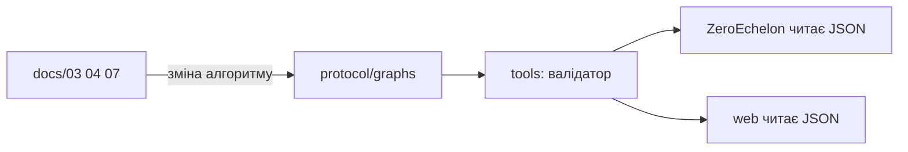

# 13 — Структура репозиторію

**Одне ядро протоколу (дані) + iOS-додаток + майбутній web.** Медицина і тексти живуть у `protocol/`. Swift лише показує вузол і пише локальний журнал.

---

## Дерево

```
Zero Echelon/
├── README.md
├── LICENSE
├── docs/
├── protocol/                # ЯДРО — graph.json, тексти
├── ZeroEchelon/             # канонічний Xcode-додаток + ZeroEchelonTests
│   ├── ZeroEchelon.xcodeproj
│   ├── project.yml
│   ├── ZeroEchelon/
│   └── ZeroEchelonTests/
├── web/                     # PWA — пізніше
└── tools/                   # валідатор — пізніше
```

Папки `ios/` більше немає (було дублювання з `ZeroEchelon/`).

---

## Хто за що відповідає

| Каталог | Відповідає | Не класти сюди |
| --- | --- | --- |
| `protocol/` | Вузли, тексти UA/EN, переходи, `engine-rules.json`, `commercial: false` | UI, Swift, React |
| `ZeroEchelon/` | Екран, TTS, журнал, тонкий інтерпретатор правил | Копії медичних `if` / черг загроз поза `protocol/` |
| `web/` | Те саме для браузера (той самий graph + engine-rules) | Інша версія алгоритмів |
| `docs/` | Людські рішення | Виконуваний код |
| `tools/` | Валідація графа | Бізнес-логіка рятування |

---

## Потік даних



Правило: **docs → protocol → клієнти**.

---

## Фази

1. ~~Каталоги + docs.~~  
2. ~~`graph.json` S0–S5b + CanLeave.~~  
3. ~~SwiftUI у `ZeroEchelon/`.~~  
4. ~~**S6–S12 + daily J у графі**~~ (`graphVersion` `2026-09-13-s0-s12`).  
5. **Далі** — PWA, валідатор, A7 loop, повний SALT Four, рецензія draft K3/K4.

ШІ (якщо буде) — лише в клієнті, **ніколи** не замінює переходи в `protocol/`.

---

## Звʼязок із документацією

| Рішення | Документ |
| --- | --- |
| Обсяг | [01](01-обсяг-роли-глосарій.md) |
| Формат вузла | [06](06-схема-даних-протоколу.md) |
| Тексти | [07](07-голосові-скрипти-UA-EN.md) |
| Екрани | [12](12-екрани-та-специфікація.md) |
