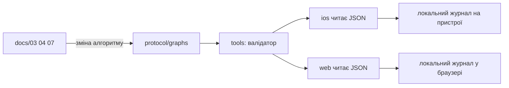

# 13 — Структура репозиторію

Мінімальний поділ під схему: **одне ядро протоколу (дані) + два клієнти (iOS і web)**. Код клієнтів тут ще не пишеться — лише каркас каталогів і правила, хто що читає.

Мета: медицина і тексти живуть у `protocol/`. Swift і веб лише показують вузол і пишуть локальний журнал. Правка алгоритму не означає правку двох додатків.

---

## Дерево

```
Zero Echelon/
├── README.md
├── LICENSE
├── docs/                    # проєктна документація (вже є)
│   ├── 01 … 13
│   └── research/
├── ZeroEchelon/             # Xcode-додаток (SwiftUI-рушій)
│   ├── ZeroEchelon.xcodeproj
│   └── ZeroEchelon/         # сирці + Resources/graph.json
├── ios/                     # SPM ZeroEchelonKit + unit-тести рушія
├── protocol/                # ЯДРО — єдине джерело істини для обох клієнтів
│   ├── README.md
│   ├── schema/
│   ├── graphs/
│   ├── locales/
│   └── fixtures/
├── web/                     # Клієнт PWA для QR без встановлення
│   ├── README.md
│   └── (статичний сайт / Vite — пізніше)
└── tools/                   # опційно: валідатор графа, експорт
    └── README.md
```

Поки що в репозиторії: docs, `protocol/` з graph S0–S5b, Xcode-додаток у `ZeroEchelon/`, тести рушія в `ios/`.

---

## Хто за що відповідає

| Каталог | Відповідає | Не класти сюди |
| --- | --- | --- |
| `protocol/` | Вузли, тексти UA/EN, переходи, версія, `commercial: false` | UI, Swift, React, мережеві ключі |
| `ios/` | Екран, TTS, QR/GNSS, локальний журнал, майбутній Core ML | Копії медичних `if` поза графом |
| `web/` | Те саме для браузера + Service Worker офлайн | Інша версія алгоритмів, ніж у `protocol/` |
| `docs/` | Людські рішення (реєстр, конфлікти, екрани) | Виконуваний код |
| `tools/` | Перевірка, що граф валідний і синхронний з docs/07 | Бізнес-логіка рятування |

---

## Потік даних



Правило: зміна фрази або кнопки йде **docs → protocol → клієнти**. Не навпаки і не «швидкий фікс лише в Swift».

---

## Версіонування ядра

У `protocol/graphs/zero-echelon-core/manifest.json` (коли з’явиться) мінімум:

- `schemaVersion` — формат вузла  
- `graphVersion` — зміст алгоритму (дата або semver)  
- `locale: ["uk","en"]`  
- `commercial: false` — інваріант ліцензії MC-IITT  
- `registryChecked` — дата звірки з docs/02  

Обидва клієнти показують `graphVersion` у «про» або в підвалі звіту — щоб на симуляції було видно, яку редакцію ганяли.

---

## Фази наповнення

1. ~~Каталоги + цей документ.~~  
2. ~~`graph.json` S0–S5b~~ — див. `protocol/graphs/zero-echelon-core/` (`2026-09-13-s0-s5b`).  
3. ~~SwiftUI-рушій~~ — `ZeroEchelon/ZeroEchelon.xcodeproj` (зріз S0–S5b).  
4. **Паралельно або слідом** — мінімальний PWA з тим самим JSON і офлайн-кешем.  
5. **Пізніше** — решта гілок S6–S12, валідатор у `tools/`.

ШІ (якщо буде) — лише в `ios/` (Core ML) або окремий модуль, **ніколи** не замінює переходи в `protocol/`.

---

## Звʼязок із документацією

| Рішення | Документ |
| --- | --- |
| Що взагалі робить продукт | [01](01-обсяг-роли-глосарій.md) |
| Формат вузла | [06](06-схема-даних-протоколу.md) |
| Тексти кнопок і голосу | [07](07-голосові-скрипти-UA-EN.md) |
| Карта екранів для людей | [12](12-екрани-та-специфікація.md) |
| Чому два клієнти | розмова про PWA + Swift; цей файл фіксує структуру |

Деталі кожного каталогу — у його `README.md`.
